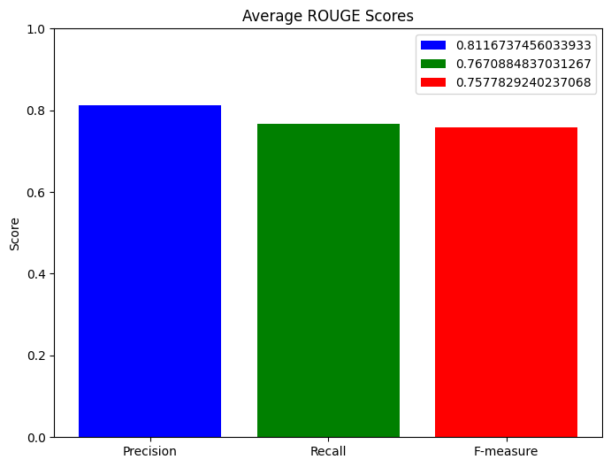

# LLM Answer Evaluation :bar_chart:

## Overview :mag:

**LLM Answer Evaluation** is a benchmarking project that evaluates the factual accuracy of Large Language Models (LLMs) using the SQuAD2.0 dataset. The project generates answers with the Llama3.2 model (via Ollama), compares them to ground truth using ROUGE-L metrics and visualizes performance with insightful plots.

### Key Features :star:
- Automated evaluation of LLM answers on SQuAD questions
- ROUGE-L scoring (Precision, Recall, F-measure)
- Visualizations for accuracy and score distribution
- Ready for further analysis of LLM truthfulness and reliability

## Tech Stack :hammer_and_wrench:
- **Llama3.2** LLM model for answer generation
- **SQuAD2.0** dataset (Stanford Question Answering Dataset v2.0)
- **Python 3.13.1**
- **Ollama** (LLM API)
- **Matplotlib** (visualization)
- **NLTK** (text processing)
- **WordCloud** (word cloud generation)
- **ROUGE-score** (evaluation metric)
- **Jupyter Notebook** (analysis and visualization)

## Visualizations :chart_with_upwards_trend:

**_Pie chart showing the proportion of exact matches between LLM answers and ground truth._**  

**_Pie chart based on F-measure (F1 score) for answer correctness._**  

**_Bar chart of average ROUGE-L Precision, Recall and F-measure across all answers._**  

## License :scroll:
[MIT](LICENSE)
